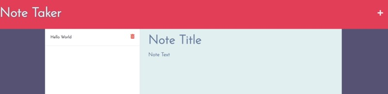

# Note Taking with Express
  
## Description

This is an application using express which allows the user to save notes and view them later. They also have the option to delete notes. When the user arrives at the page, they will click the button to get started. Then they are presented with the notes page, they can type in a new note and click the "save" icon. Once saved, the note will populate in a list to the left of the main add notes area. If they click a previously added note, it will show up in the main notes area where it can be viewed. 

## Technologies Used

HTML, CSS, JS, Node.js, Express.js

## Live Deployment of the Application

[Live Deployment](https://msherrill-notetaker.herokuapp.com/)

## Screenshots

## Future Development Plans 

- Take this out of populating to a json file and move it to a database. 
- Add user athentication, so users can keep track of their individual notes - where right now, it would be collective. 
- Add a wide range of organizational tools including to-do lists and a calendar

## Contributing
  
To contribute to this project, fork this repo and send a pull request for any suggest changes. They will be reviewed as received.
      
## Questions

*Find me on GitHub* [@m-sherrill](https://github.com/m-sherrill)

*Have additional questions?* mo.sherrill@outlook.com
